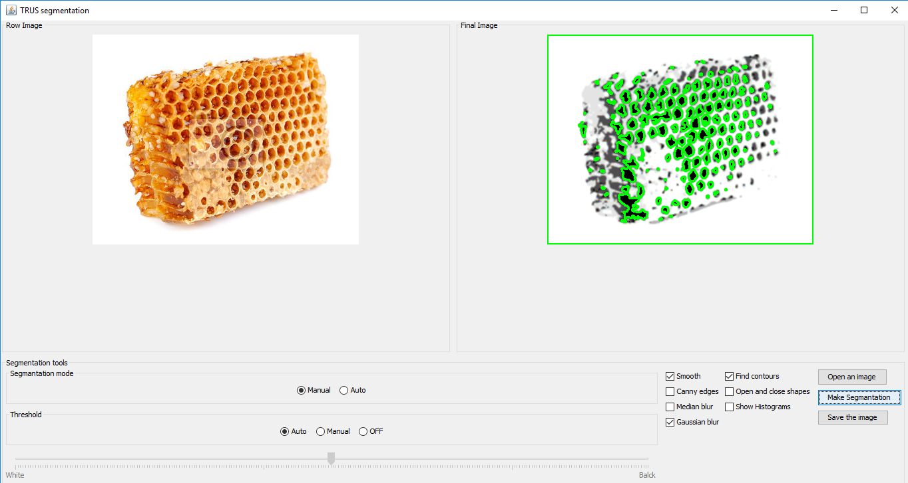

# Segmentation

## General establishment
The program was made for do segmentation a prostate in TRUS images.

## Program description
As you can see on the pictrure above user can make segementation by two ways.
#### 1. WITH DEFAULT SETTINGS ####
This mode are set by default. Then standard settings Otsu's tresholding method is used and
#### 2. WITH MANUAL SETTINGS ####
In this mode treshold can be set manuals and other processing can be added or deleted.

Independent the mode the image is converted to 8-bit and histogram is stretched.

## Technical aspects
Input images can be color or monochromatic and should be saved in one of the following formats:
jpg, gif, tiff, tif, png, dicom, bmp

#### Referenced Libraries
* opencv-320.jar
* imagej-1.46.jar

Moreover for run the project opencv native librtary in C++ is required.

